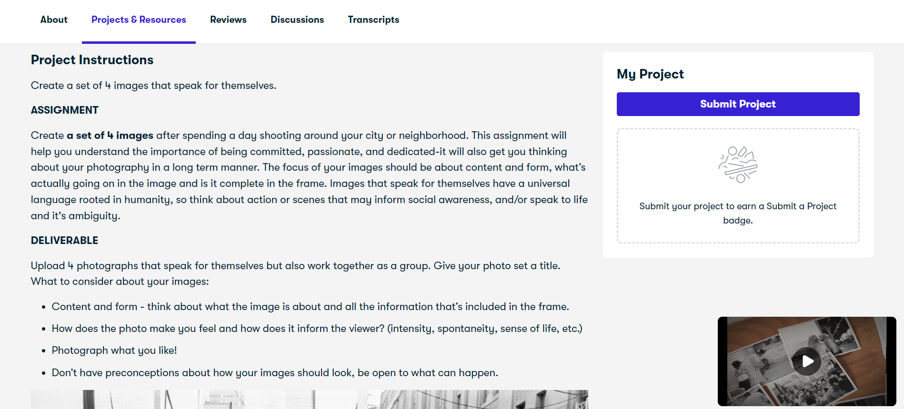

# The Computer in School: Tutor, Tool, Tutee
## Review Skillshare

**Skillshare** adalah sebuah platform pembelajaran online yang menawarkan berbagai kelas seperti kelas kreatif, teknologi, bisnis, gaya hidup dan masih banyak lagi. Platform ini menggunakan sistem pembayaran berlangganan bulanan atau tahunan di mana pengguna dapat mengakses semua kelas tanpa ada batasan.  Pada setiap kelas terdapat pengajar yang telah berpengalaman dan profesional di bidangnya masing-masing yang pengguna dapat ajak untuk berdiskusi.

1. Sebagai Tutor:
>Platform Skillshare bekerja sebagai tutor dengan menerima dan menyediakan pengajar sebagai instruktur dari individu yang telah profesional dibidangnya sebagai pengajar atau mentor yang telah menyiapkan kelasnya dengan materi pelajaran sesuai bidang kelas masing-masing.

2. Sebagai Tool:
>Pada platform Skillshare, terdapat fitur yang membantu dalam pembelajaran yaitu dengan tutor berupa video instruksi yang telah disiapkan oleh pengajar dan pengerjaan tugas proyek yang dilakukan oleh peserta didik untuk menerapkan pemahaman yang telah didapat dari materi pembelajaran. Juga pada beberapa kelas terdapat fitur untuk dapat berinteraksi dengan peserta kelas lainnya. Terdapat pula materi pembelajaran yang telah disiapkan oleh pengajar. Dengan berbagai tool pembelajaran ini, pengguna dapat menyesuaikan kebutuhan dan kecepatan belajar sesuai kebutuhan kapanpun.

3. Sebagai Tutee:
>Skillshare mengumpulkan data dari pengguna dalam menggunakan layanan seperti mungkin kelas yang sering diambil, durasi dalam mengikuti video atau materi pembelajaran kelas, hingga umpan balik yang kita berikan terhadap tugas peserta kelas lainnya. Dari data ini lah digunakan untuk menyesuaikan pengalaman pengguna misal seperti memberikan rekomendasi kelas-kelas baru yang mungkin menarik pengguna. Feedback lainnya dari pengguna juga dapat digunakan untuk meningkatkan kualitas platform secara keseluruhan
